

# Prdok_

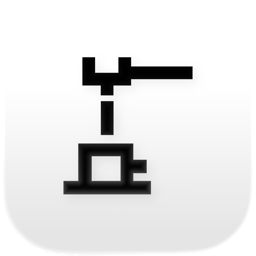

**A native Android app for workplace shift management, written in Kotlin and Jetpack Compose.**

The Android version of the [prdok iOS app](https://github.com/taf-fs/prdok).

 

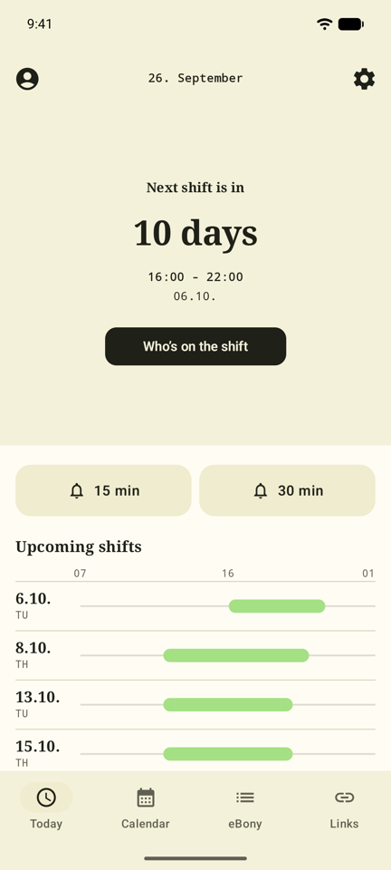
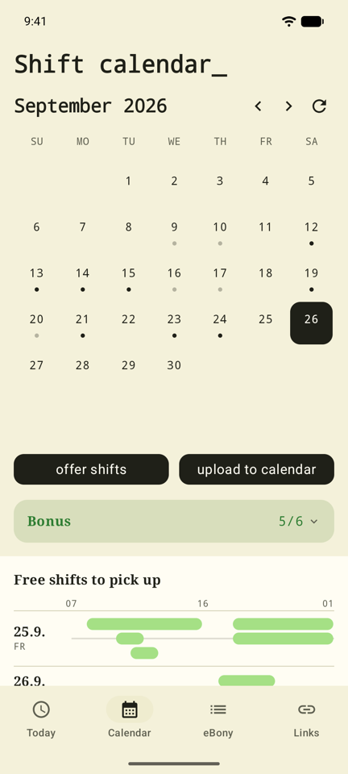
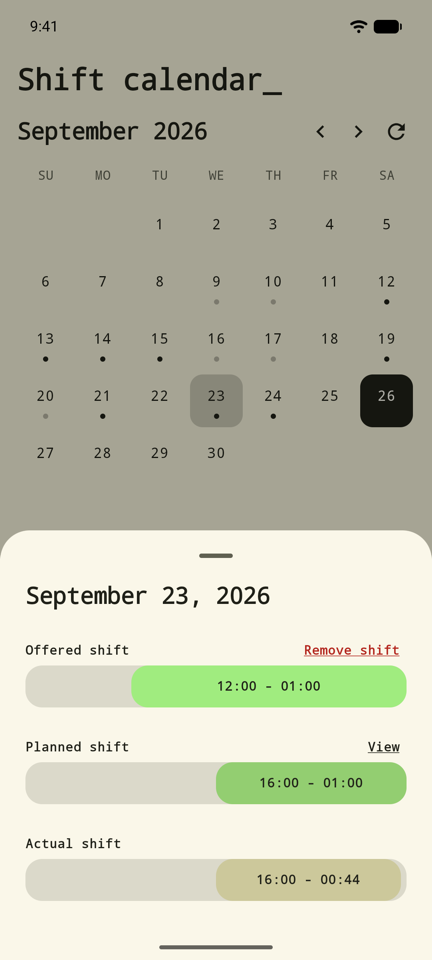
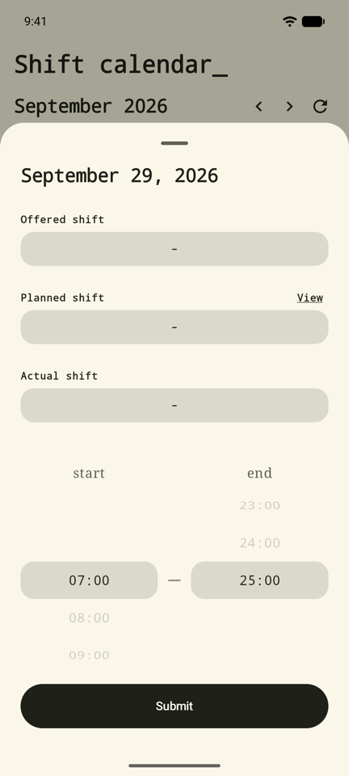

## Download

Signed APKs are published on the [Releases](https://github.com/taf-fs/prdok-android/releases) page. The app checks for new releases itself and offers the update when one is out.

## Tech Stack

| Area | Choice |
|---|---|
| Language | Kotlin 2.2 |
| UI | Jetpack Compose, Material 3 |
| Async | Kotlin Coroutines (`suspend`, `Flow`, `StateFlow`) |
| Networking | [OkHttp](https://github.com/square/okhttp) with form URL-encoded POST requests, `kotlinx.serialization` |
| Data layer | Repository pattern with a file-based monthly cache |
| Calendar | [Calendar](https://github.com/kizitonwose/Calendar) by kizitonwose, [datetime-wheel-picker](https://github.com/darkokoa/compose-datetime-wheel-picker) |
| QR Scanning | CameraX + ML Kit barcode scanning |
| Web | AndroidX WebKit (separate WebView profiles) |
| Persistence | Jetpack DataStore |

## Architecture

The app is built on MVVM. ViewModels load data with coroutines and expose it as `StateFlow` to Compose screens, with a repository layer underneath handling caching and networking. Dependencies are wired by hand through a single `AppContainer`.

## Requirements

- Android 8.0 (API 26)+
- Android Studio with JDK 11+
- Access to the backend API (credentials configured via `secrets.properties`, see `secrets.example.properties`)

 

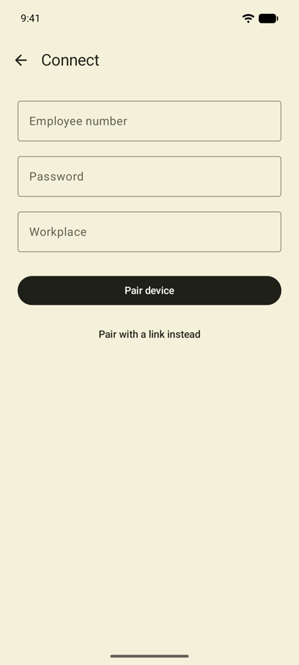

Login - first run pairs the device by credentials, link or QR code.

---

<b>🇨🇿 Česky</b>

# Prdok_

**Nativní Android aplikace pro správu pracovních směn, napsaná v Kotlinu a Jetpack Compose.**

Android verze [iOS aplikace prdok](https://github.com/taf-fs/prdok).

 

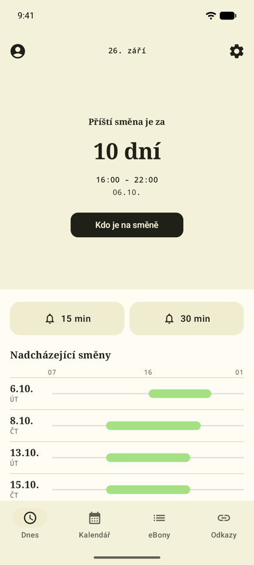
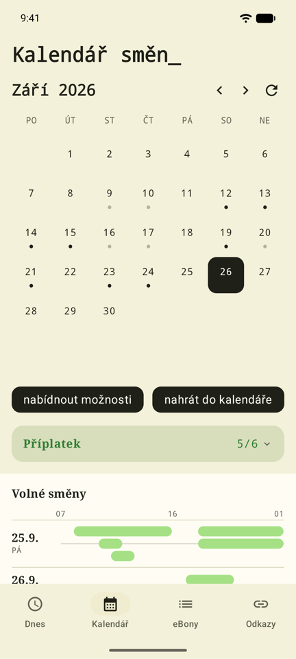
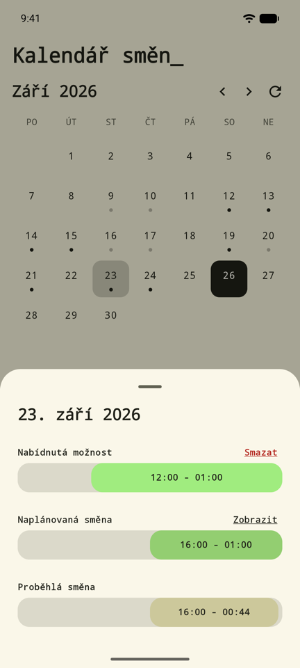
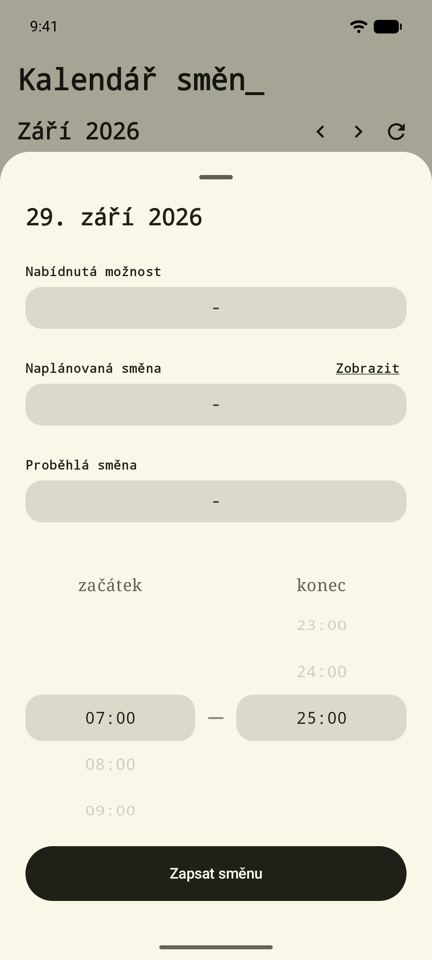

## Stažení

Podepsaná APK najdeš na stránce [Releases](https://github.com/taf-fs/prdok-android/releases). Aplikace sama kontroluje nové verze a nabídne aktualizaci, jakmile nějaká vyjde.

## Technologie

| Oblast | Volba |
|---|---|
| Jazyk | Kotlin 2.2 |
| UI | Jetpack Compose, Material 3 |
| Asynchronicita | Kotlin Coroutines (`suspend`, `Flow`, `StateFlow`) |
| Síť | [OkHttp](https://github.com/square/okhttp) s form URL-encoded POST požadavky, `kotlinx.serialization` |
| Datová vrstva | vzor Repozitář se souborovou cache po měsících |
| Kalendář | [Calendar](https://github.com/kizitonwose/Calendar) od kizitonwose, [datetime-wheel-picker](https://github.com/darkokoa/compose-datetime-wheel-picker) |
| Skenování QR | CameraX + ML Kit barcode scanning |
| Web | AndroidX WebKit (oddělené WebView profily) |
| Persistence | Jetpack DataStore |

## Architektura

Aplikace je postavena na MVVM. ViewModely načítají data přes coroutines a vystavují je jako `StateFlow` pro Compose obrazovky, přičemž pod nimi leží vrstva repository zajišťující cache a síťovou komunikaci. Závislosti jsou propojené ručně přes jediný `AppContainer`.

## Požadavky

- Android 8.0 (API 26)+
- Android Studio s JDK 11+
- Přístup k backendovému API (přihlašovací údaje nakonfigurovány v `secrets.properties`, viz `secrets.example.properties`)

 

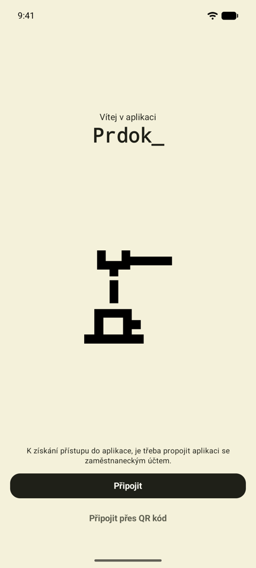
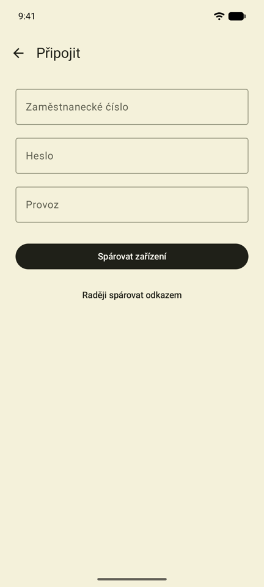

Přihlášení - první spuštění spáruje zařízení přes odkaz, přihlašovací údaje nebo i QR kód.

